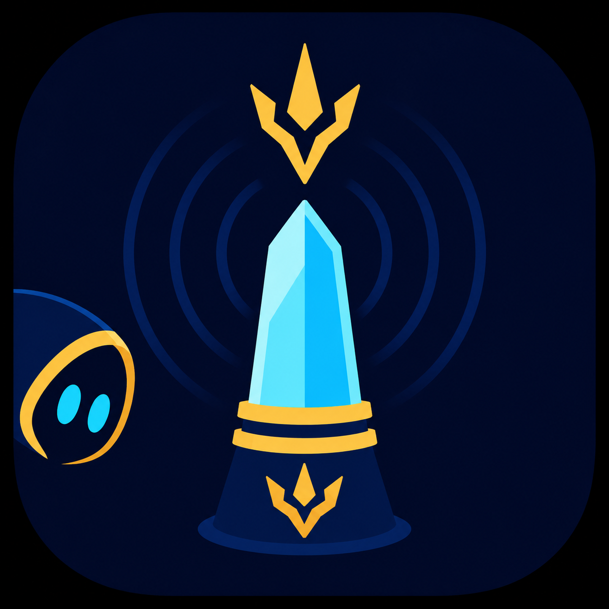

# PFBeacon

<p align="center">
  
</p>

Finding MINE Party Finder groups is mostly a timing problem. The listing you care about might appear while you're crafting, in a duty, alt-tabbed, or simply looking at the wrong Discord channel.

PFBeacon helps with that. The plugin watches Party Finder, filters for qualifying MINE raid listings, and contributes **sanitized** observations to the official PFBeacon service. Discord servers that have opted in can then receive compact alerts when relevant PFs appear.

The goal is simple: help people find old-content groups faster, while keeping descriptions, names, worlds, and Discord routing out of the plugin payload entirely.

## What it does

* Watches Party Finder listings when you open or refresh the Party Finder window
* Filters for 8-player Extreme, Savage, Ultimate, and Unreal listings
* Requires Minimum Item Level and No Echo
* Sends sanitized observations to the PFBeacon service
* Helps the Discord bot keep alerts active, stale, or deleted as PF listings change

## Privacy

PFBeacon sends only the data needed for alerts, such as duty name, data center, MINE flags, category, role/job slot summaries, timestamps, and listing IDs.

PFBeacon does **not** send:

* PF descriptions
* recruiter names
* player names
* player worlds
* host/player content IDs
* chat messages
* Discord guild IDs or channel IDs
* Discord bot tokens or webhooks

Submitted observations may update alert channels in all Discord guilds that have opted into the same PFBeacon bot service.

## Important behavior

PFBeacon does **not** continuously scan Party Finder in the background and does **not** query Square Enix servers on its own. It only sees listings when you open the Party Finder window, change filters, switch tabs, or refresh the list in-game.

So if nobody with the plugin opens or refreshes the Party Finder window, PFBeacon has nothing new to send.

## Requirements

* Final Fantasy XIV with Dalamud
* A PFBeacon API token from the Discord bot command:

```text
/pf register
```

A Discord server admin also needs to invite and configure the PFBeacon bot before alerts can appear in that server.

## Installation

PFBeacon is **not** in the official Dalamud plugin repository. Install it as a third-party/custom plugin.

1. Open Dalamud settings in-game with `/xlsettings`
2. Go to `Experimental`
3. Add this custom plugin repository URL:

```text
https://raw.githubusercontent.com/Miu-B/PFBeaconPlugin/main/repo.json
```

4. Open the Plugin Installer with `/xlplugins`
5. Search for **PFBeacon** and install it

Dalamud may show the usual warning for third-party repositories. That's expected; only add repositories you trust.

## How to use

1. In Discord, run:

```text
/pf register
```

2. Copy the token from the bot's ephemeral response
3. In-game, open PFBeacon with:

```text
/pfbeacon
```

4. Paste the token into the **Token** field
5. Click **Test connection**
6. Enable **Contribute sanitized PF observations**

That's it. When you open or refresh Party Finder and qualifying MINE listings are visible, the plugin contributes sanitized observations to PFBeacon.

## Commands

* `/pfbeacon` - Toggle the configuration window
* `/pfbeacon status` - Write a local status line to the Dalamud log

## Development

Build a release package with:

```bash
dotnet build src/PFBeacon/PFBeacon.csproj -c Release
```

The Dalamud package is generated at:

```text
src/PFBeacon/bin/Release/PFBeacon/latest.zip
```

## License

MIT

## Credits

Based on the Dalamud plugin ecosystem and the `Dalamud.NET.Sdk` packaging flow by goatcorp.
